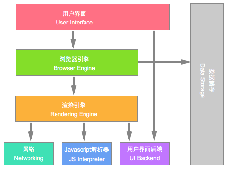

## 瀏覽器的組成

瀏覽器分為兩部分：

- 渲染引擎（瀏覽器內核）。
- JS引擎。

### 1、渲染引擎（瀏覽器內核）

瀏覽器所採用的「渲染引擎」，也被稱作「瀏覽器內核」，用來解析HTML與CSS。渲染引擎決定了瀏覽器如何顯示網頁的內容以及頁面的格式信息。

渲染引擎的英文是 Rendering Engine（也可稱排版引擎）。通俗來說，它的作用是：讀取網頁內容，計算網頁的顯示方式並顯示在頁面上。

常見的瀏覽器的內核如下：

|瀏覽器 | 内核|
|:-------------:|:-------------:|
|Chrome | Blink  |
|Safari　|Webkit|
|Firefox　|Gecko|
|IE　| Trident |

> 另外手機（移動端）上所使用的瀏覽器可以查一下。

## 瀏覽器工作原理

> 這邊先看過，以後深入理解後再回來翻。

1、User Interface  使用者介面，我們所看到的瀏覽器。

2、Browser engine 瀏覽器引擎，用來查詢和操作渲染引擎。

3、Rendering engine 用來顯示請求的內容，負責解析HTML、CSS。

4、Networking   網路，負責發送網路請求。

5、JavaScript Interpreter(解析者)   JavaScript解析器，負責執行JavaScript的代碼。

6、UI Backend   UI後端，用來繪製類似下拉式列示方塊和快顯視窗。

7、Data Persistence(持久化)  資料持久化，資料存儲  cookie、HTML5中的sessionStorage。

- 可參考［瀏覽器的工作原理］：https://www.html5rocks.com/zh/tutorials/internals/howbrowserswork/
